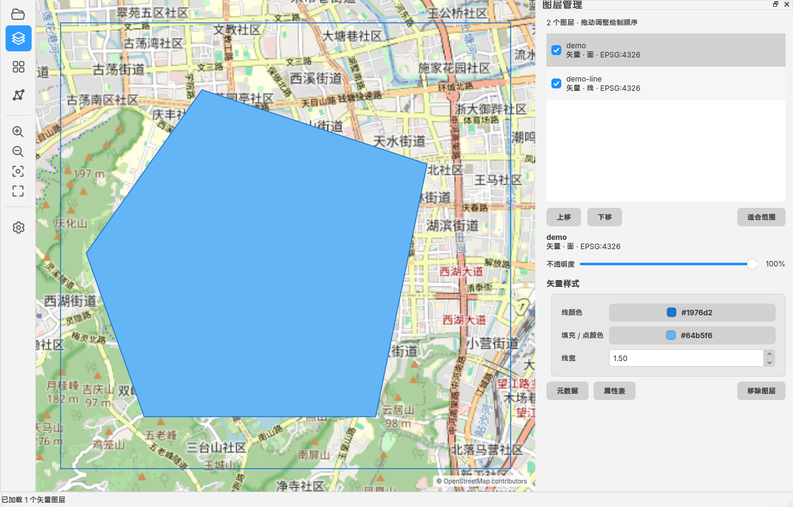
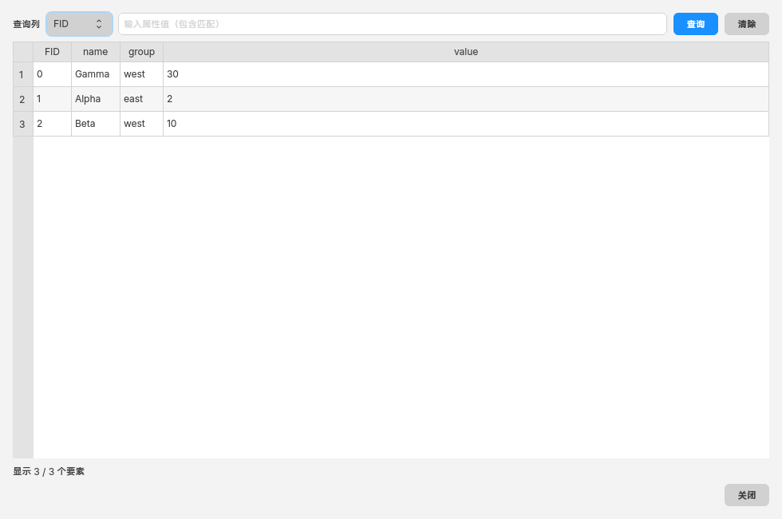

# GeoReader

GeoReader 是一款以 **Qt 6 + Mapnik + GDAL/OGR** 构建的现代桌面空间数据浏览器。它默认显示 OpenStreetMap 底图，可叠加查看 Shapefile、GeoJSON、GeoPackage 和 GeoTIFF。

当前版本聚焦 QGIS 中的数据浏览、可视化和识别操作，并以更紧凑、现代的
界面重新实现；不包含空间数据编辑与复杂分析功能。

## 界面预览

图层管理面板支持样式即时调整、元信息/属性表入口，以及通过右侧手柄拖动
改变 Canvas 中的合成顺序。



矢量属性表为居中、非模态的可拖动悬浮窗口，支持列排序和指定字段查询。



## 已实现

- OpenStreetMap 标准瓦片底图、磁盘缓存和署名
- 参考 QGIS 的互斥地图工具：默认平移、滚轮缩放、矩形框选缩放、
  矢量要素识别和栅格像元识别
- 矩形框选缩放，按 `Esc` 可取消框选
- 使用系统原生文件对话框打开：
  - Shapefile (`.shp`)
  - GeoJSON (`.geojson`, `.json`)
  - GeoPackage (`.gpkg`，按子图层加入)
  - GeoTIFF (`.tif`, `.tiff`)
  - 自动记住最近一次成功打开文件的目录；目录失效时回退到系统文稿目录
- 图层管理：
  - 通过拖动手柄调整图层顺序；列表顶部图层在地图中位于最上方，
    矢量和栅格可任意交错
  - 显示/隐藏、移除、不透明度
  - 按需查看矢量或栅格元信息，包括驱动、坐标参考系、投影定义、
    数据范围、字段/几何信息以及栅格尺寸、数据类型、像素大小、块大小
    和 NoData
  - 矢量线色、填充色和线宽
  - 单波段数据直接显示 Viridis、Plasma、Inferno、Magma、Cividis、
    Turbo、Terrain 和 Gray 色带，每种色带均支持正向和反向
  - 多波段数据直接显示 R/G/B 三行波段下拉选择
  - 最小值–最大值、2%–98% 累计裁剪、均值 ±2σ 和直方图均衡化
    四种拉伸方式
  - 色带、波段、拉伸范围和 NoData 修改后即时生效，无额外应用按钮
  - 每个波段的显示最小值/最大值可调整，NoData（含 `nan`）默认透明
- 栅格图层先读取元数据并立即加入地图，近似统计在后台更新，避免打开文件
  时阻塞 UI
- 栅格只读取当前地图视窗，并根据屏幕像素大小自动使用 GeoTIFF 内部或
  外部 overview（金字塔）；同一视窗的波段浮点数据使用 256 MiB LRU 缓存
- 色带、色带方向、拉伸范围和透明度只对缓存数据做内存着色，不重新扫描
  整幅栅格
- 打开栅格值面板后，随鼠标移动实时查询所有可见栅格的像元值
- 左下角经纬度使用 `E/W` 与 `N/S` 半球方位标记
- 打开矢量属性面板后自动选择首个可见矢量图层，单击地图即可查询；
  线、点、面要素命中后均会高亮并显示属性
- 矢量图层可打开居中、非模态且可拖动的属性表；按列头进行数值/文本
  升降序排列，并可选择字段后按属性值进行不区分大小写的包含查询；窗口
  主体可向左右或下方拖出主界面并自动裁剪，同时始终保留可拖回的标题栏区域
- 简体中文与 English 即时切换
- 字体、字号、语言、工具栏透明度（默认 0.85）、Qt Quick Style 和
  快捷键持久化
- 工具栏采用 Heroicons 24 px outline 图标；APP Icon 使用蓝紫渐变的
  小圆角三图层设计，并提供 macOS `.icns`、Windows `.ico` 和 Linux SVG
- 跨平台默认 Style：
  - macOS：`FluentWinUI3`
  - Windows：`FluentWinUI3`
  - Linux：`FluentWinUI3`
- Linux 原生支持 Wayland，并保留 X11/XWayland 回退；Wayland 会话中默认
  按 `wayland;xcb` 顺序选择 Qt QPA 后端，用户设置的 `QT_QPA_PLATFORM`
  始终具有更高优先级

> Qt Quick Style 必须在 QML 控件创建前设置，因此 Style 修改会在下次启动生效；字体、图层样式和波段修改即时生效。

## 版权与使用

本 APP 由西北大学谭振宇团队开发。用户可以免费分发和使用；商业使用
必须获得作者授权。项目采用
[PolyForm Noncommercial License 1.0.0](LICENSE)，允许非商业用途下使用、
修改和分发；商业用途需要另行取得许可。相同声明也可在 GeoReader 的
“设置”面板中查看。

## 设计架构

GeoReader 将界面、状态、地图交互和数据渲染分开，避免 QML 直接持有
GDAL/OGR 或 Mapnik 对象：

```text
Qt Quick / Main.qml
  ├─ 左侧工具栏、缩放工具、状态条
  ├─ 图层/栅格值/矢量属性/设置浮动面板
  ├─ 可拖动的元信息窗口与非模态属性表
  └─ 双语文本、快捷键、样式输入
            │
            ▼
AppController
  ├─ 系统文件对话框、设置持久化、语言切换
  ├─ GDAL/OGR 数据集识别、范围与坐标系转换
  ├─ 后台栅格统计
  └─ 栅格像元与矢量要素查询
            │
            ├──────────────► LayerModel
            │                 └─ QAbstractListModel + LayerSnapshot
            ├──────────────► AttributeTableModel
            │                 └─ OGR 字段读取、列排序与属性筛选
            ▼
MapCanvas / QQuickPaintedItem
  ├─ Web Mercator 视口、平移/缩放/框选/识别工具
  ├─ OSM 256 px 瓦片请求与磁盘缓存
  ├─ RasterRenderer：GDAL 视窗读取、金字塔与内存着色
  ├─ Mapnik：矢量样式与透明背景离屏渲染
  └─ QPainter：底图、栅格、矢量和选中高亮合成
```

### 图层状态

`LayerModel` 是 UI 与渲染器之间唯一的图层状态源。每个
`LayerSnapshot` 包含数据路径、图层类型、坐标系、可见性、不透明度、
矢量符号、RGB/单波段配置、色带方向、波段范围和 NoData。后台任务只接收
快照副本和值类型视口，不访问 QML 对象，也不会持有会随 UI 变化的
`QModelIndex`。

设置使用 `QSettings` 持久化。Qt Quick Style 必须在控件创建前选择，
因此重启后生效；字体、语言、工具栏透明度、快捷键和图层显示参数即时
生效。

### 地图坐标与合成顺序

OSM 和 `MapCanvas` 使用 EPSG:3857。加载数据时 GDAL/OGR 将图层范围转换为
WGS 84 供“缩放至图层”使用；渲染时栅格由 GDAL 动态重投影到当前
Web Mercator 视窗，矢量由 Mapnik 依据图层 SRS 重投影。

绘制顺序为：

1. OSM 底图瓦片；
2. 从图层列表底部到顶部依次绘制所有可见图层，矢量与栅格可以任意交错；
3. 当前选中要素的白色外描边和橙色高亮；
4. 框选矩形与界面控件。

拖动排序调用 `QAbstractListModel::beginMoveRows/endMoveRows`，更新后触发新
generation 的离屏渲染，因此 UI 顺序、`LayerSnapshot` 快照顺序与 Canvas
合成顺序始终一致。

## 元信息与属性表

元信息在用户打开详情时才通过 GDAL/OGR 读取，避免拖慢普通图层加载。
矢量元信息包含驱动、源图层、几何类型、要素/字段数量、字段存储类型、
字符编码和完整投影定义；栅格元信息包含尺寸、波段数、像素与块大小、
波段数据类型、颜色解释、NoData、仿射变换和完整投影定义。

`AttributeTableModel` 是只读 `QAbstractTableModel`。打开属性表时以 RAII
方式读取所选 OGR 图层并缓存字段字符串；`TableView` 只实例化可见单元格。
列头排序会优先按数值比较，在不能解析为数值时使用本地化文本比较；查询
对指定列执行不区分大小写的包含匹配。属性表是非模态浮动窗口，地图及其他
面板仍可继续操作。字段较少时各列自动均分并填满表格视口；字段较多时保持
可读的最小列宽，通过横向滚动查看其余字段。

## 栅格渲染策略

### 1. 即时打开与异步统计

打开 GeoTIFF 时，主线程只读取尺寸、地理变换、坐标系、波段数、NoData
和已经存在的统计元数据。没有统计信息时先使用数据类型范围作为可用默认
值，使图层可立即加入地图。随后 `QtConcurrent` 后台任务以 128×128
低分辨率样本估计各波段范围，并在完成后更新图层拉伸值。该过程不会在
文件打开对话框之后阻塞界面。

### 2. 随缩放级别选择金字塔

`RasterRenderer` 不读取整幅影像，而是把当前 EPSG:3857 视窗范围和
Canvas 像素尺寸交给 GDAL Warp。参数 `-ovr AUTO` 会按目标地面分辨率
自动选择最接近的 internal overview 或外部 `.ovr`：

- 地图缩小时读取更粗的金字塔层，减少磁盘读取和解压；
- 地图放大时逐步选择更高分辨率层，显示更多细节；
- 没有 overview 时 GDAL 仍直接输出屏幕目标尺寸的粗采样，不生成整幅
  中间图像，也不修改用户源文件。

对于特别大的生产数据，建议预先创建 overview，例如：

```bash
gdaladdo -r average your-data.tif 2 4 8 16 32
```

如不希望修改 GeoTIFF，可让 GDAL 生成外部 `.ovr`。GeoReader 当前不会
未经确认写入用户数据；后续可增加显式的“构建金字塔”命令和应用缓存目录。

### 3. 视窗缓存与快速换色

GDAL 输出的是当前视窗所需波段的 `Float32` 数据和 alpha mask，而不是
已经着色的 PNG。缓存键由源路径、修改时间、视窗范围、输出尺寸、所选
波段和 NoData 设置组成，采用线程安全的 256 MiB LRU 缓存：

- 修改色带、正反方向、拉伸范围或图层不透明度：复用浮点缓存，仅执行
  C++ 内存插值与着色；
- 修改 RGB 波段组合、NoData、视窗范围或缩放级别：读取新的视窗数据；
- 修改源文件后：文件修改时间变化，旧缓存不会被命中。

单波段色带采用相邻色标的线性 RGB 插值；反向色带通过反转归一化位置
实现。RGB 模式分别对三个所选波段进行拉伸。除手动最小值–最大值外，
2%–98% 累计裁剪、均值 ±2σ 和直方图均衡化均从当前视窗缓存估算，不会
重新读取源数据；直方图使用 1024 个区间。GDAL 生成的 alpha mask 与图层
不透明度相乘，NoData（包括 `nan`）保持透明。

### 4. 后台渲染与过期帧丢弃

地图叠加层在 `QtConcurrent` 工作线程中渲染。连续平移或缩放会增加
generation 编号并由短计时器合并频繁请求；任务结束时只有与当前
generation 一致的结果才能进入 Canvas，过期帧会被丢弃。这样既避免 UI
线程进行重投影和逐像素着色，也避免旧视图覆盖用户的新视图。

### 5. 实时像元查询

栅格识别模式使用十字光标。QML 以 45 ms 周期持续消费最新鼠标坐标，
而不是等待鼠标停止或单击；仅在坐标变化时查询。只读 GDAL dataset 句柄
按文件复用，鼠标移动不会反复打开文件。查询结果包含所有可见栅格的像素
行列号和各波段值。

## C++20 与资源安全

- GDAL/OGR 句柄使用带自定义析构器的 `std::unique_ptr` 或受控的
  `std::shared_ptr`，确保异常和提前返回时仍正确关闭；
- 后台结果使用值语义结构体，缓存内容用 `std::shared_ptr` 保证跨线程
  读取期间的生命周期；
- `std::clamp`、结构化绑定、`[[nodiscard]]`、RAII 和不可变快照用于
  减少边界错误与隐式所有权；
- 渲染缓存由 `QMutex` 保护，QML/GUI 状态只在主线程更新；
- CMake 强制 `CMAKE_CXX_STANDARD 20` 且关闭编译器扩展。

## 开发环境

- 支持 C++20 的编译器
- CMake 3.25+
- Qt 6.8+：Core、Gui、Network、Qml、Quick、QuickControls2、Widgets、
  Concurrent、LinguistTools
- GDAL 3.8+
- Mapnik 4.x（含 `shape`、`geojson`、`ogr`、`gdal` 输入插件）
- ICU（Mapnik 依赖）

`CMakeLists.txt` 会查找 Homebrew、常见 Unix 安装位置以及 vcpkg triplet。
也可以显式传入 `MAPNIK_INCLUDE_DIR`、`MAPNIK_LIBRARY` 和
`MAPNIK_INPUT_PLUGIN_DIR`。

应用图标以 `resources/icons/georeader.svg` 为唯一设计源。修改 SVG 后，
可使用以下命令同步生成包含标准 Retina 尺寸的 macOS ICNS 和 Windows
多尺寸 ICO（需要 `rsvg-convert` 与 ImageMagick）：

```bash
python3 scripts/generate_icons.py
```

## 手动构建与清理脚本

仓库提供功能对等的跨平台脚本：

- macOS、Ubuntu、Fedora、CachyOS：`scripts/build.sh` 和
  `scripts/clean.sh`
- Windows 10/11 x64：`scripts/build.ps1` 和 `scripts/clean.ps1`

macOS/Linux：

```bash
# Release 配置并编译
./scripts/build.sh

# 清理后重新编译
./scripts/build.sh --clean-first

# Debug 构建，限制为 8 个并行任务
./scripts/build.sh --type Debug --jobs 8

# 自动选择本平台包：macOS→DMG、Ubuntu→DEB、Fedora→RPM、
# CachyOS→TGZ
./scripts/build.sh --clean-first --package

# 也可显式选择 Linux 包格式
./scripts/build.sh --package --package-format deb
./scripts/build.sh --package --package-format rpm
```

额外的 CMake 参数放在 `--` 后面：

```bash
./scripts/build.sh -- \
  -DMAPNIK_INPUT_PLUGIN_DIR=/usr/lib/mapnik/input
```

Windows Developer PowerShell：

```powershell
# Release 构建；若设置了 VCPKG_ROOT，会自动使用 vcpkg manifest
.\scripts\build.ps1

# 清理后构建，并生成 NSIS（未安装 NSIS 时 auto 回退为 ZIP）
.\scripts\build.ps1 -CleanFirst -Package

# 显式生成 NSIS 和 ZIP
.\scripts\build.ps1 -Package -PackageFormat all

# 额外 CMake 参数
.\scripts\build.ps1 -CMakeArgs @(
  "-DCMAKE_PREFIX_PATH=C:\Qt\6.8.3\msvc2022_64"
)
```

清理脚本默认删除 `build*`、`stage*` 和检查用临时目录，但保留 `dist*`
目录中的最终产物。每次普通构建也会把当前平台可运行程序复制到
`dist/runtime/<平台-架构>/`，因此清理后仍可以直接启动：

```bash
# 仅显示将要删除的内容
./scripts/clean.sh --dry-run

# 清理构建中间文件，保留安装包
./scripts/clean.sh

# 同时删除可运行程序和安装包；该操作需要显式指定
./scripts/clean.sh --all
```

Windows 对应命令为：

```powershell
.\scripts\clean.ps1 -DryRun
.\scripts\clean.ps1
.\scripts\clean.ps1 -All
```

## 在 macOS 上编译

这是本项目的主要本地开发环境。Intel 与 Apple Silicon 使用同一组命令，
Homebrew 会自动安装当前机器架构的库：

```bash
brew install cmake ninja qt gdal mapnik
./scripts/build.sh
open build/GeoReader.app
```

如果只想运行二进制而不通过 Finder：

```bash
build/GeoReader.app/Contents/MacOS/GeoReader
```

生成可分发的 DMG 还需要 `dylibbundler`。脚本会先由 `macdeployqt`
部署 Qt，再递归收集 Homebrew 的 Mapnik、GDAL 和 ICU 动态库：

```bash
brew install dylibbundler
./scripts/build.sh --clean-first --package
```

输出为 `dist/GeoReader-macOS-arm64.dmg` 或
`dist/GeoReader-macOS-x86_64.dmg`。当前自动包使用 ad-hoc 签名，
尚未使用 Apple Developer ID 签名和公证。

## 在 CachyOS / Arch Linux 上编译

CachyOS 可直接使用 Arch 仓库中的 Qt、GDAL 和 Mapnik，适合日常开发：

```bash
sudo pacman -S --needed \
  base-devel cmake ninja \
  qt6-base qt6-declarative qt6-tools qt6-wayland \
  gdal mapnik icu

./scripts/build.sh
./build/GeoReader
```

如果 CMake 没有自动找到 Mapnik 输入插件，可以先定位插件：

```bash
pacman -Ql mapnik | grep '/mapnik/input/.*\.input$'
```

然后重新配置，例如：

```bash
cmake -S . -B build -G Ninja \
  -DCMAKE_BUILD_TYPE=Release \
  -DMAPNIK_INPUT_PLUGIN_DIR=/usr/lib/mapnik/input
```

CachyOS 原生使用 pacman 软件包，不建议在本机安装 CI 生成的 DEB/RPM；
在 CachyOS 上直接使用上述本地构建即可。若需要归档产物，可执行
`./scripts/build.sh --package` 生成 TGZ。

## 在 Windows x64 上编译

准备 Visual Studio 2022 C++ 工具链、CMake、Ninja、Qt 6.8 的
`msvc2022_64` 桌面组件和 Git。GDAL 与 Mapnik 使用仓库中的
`vcpkg.json` 安装，以下命令在 Developer PowerShell 中执行：

```powershell
git clone https://github.com/microsoft/vcpkg.git C:\src\vcpkg
git -C C:\src\vcpkg checkout 827a2e1203bc19941126c657166da44f2623acc4
C:\src\vcpkg\bootstrap-vcpkg.bat -disableMetrics

$env:VCPKG_ROOT = "C:\src\vcpkg"
$env:QTDIR = "C:\Qt\6.8.3\msvc2022_64"
.\scripts\build.ps1
.\dist\runtime\Windows-x64\bin\GeoReader.exe
```

Qt 的实际小版本或安装目录不同时，请调整 `CMAKE_PREFIX_PATH`。
生成完整 NSIS 安装程序时先安装 [NSIS](https://nsis.sourceforge.io/)，
并让 CMake 一并安装 vcpkg 运行库：

```powershell
choco install nsis
.\scripts\build.ps1 -CleanFirst -Package -PackageFormat nsis
```

## 在 Ubuntu / Fedora Linux x64 上编译

安装满足版本要求的编译器、CMake、Ninja、Qt、GDAL、Mapnik 和 ICU
开发包后，两种发行版使用同一个脚本：

Wayland 运行环境还需要对应的 Qt 平台插件：

```bash
# Ubuntu
sudo apt install qt6-wayland libwayland-client0 libwayland-egl1

# Fedora
sudo dnf install qt6-qtwayland wayland-libs libxkbcommon
```

```bash
./scripts/build.sh

# Ubuntu 自动生成 DEB
./scripts/build.sh --package

# Fedora 自动生成 RPM
./scripts/build.sh --package
```

脚本通过 `/etc/os-release` 自动识别 Ubuntu/Fedora；也可以在任一发行版
显式指定 `--package-format deb`、`rpm` 或 `all`。若系统仓库版本较旧，
可按 GitHub Actions 的做法安装 Qt 6.8，并通过 vcpkg 构建 GDAL/Mapnik：

```bash
# Ubuntu：vcpkg 构建 GDAL/FreeXL 等依赖时需要 GNU Autotools。
sudo apt install autoconf autoconf-archive automake libtool

# Fedora / CachyOS 分别使用：
sudo dnf install autoconf autoconf-archive automake libtool
sudo pacman -S autoconf autoconf-archive automake libtool
```

```bash
git clone https://github.com/microsoft/vcpkg.git .vcpkg
git -C .vcpkg checkout 827a2e1203bc19941126c657166da44f2623acc4
./.vcpkg/bootstrap-vcpkg.sh -disableMetrics
python3 scripts/prepare_vcpkg_overlay.py \
  --vcpkg-root .vcpkg \
  --output .vcpkg-overlays

./scripts/build.sh -- \
  -DCMAKE_PREFIX_PATH=/path/to/Qt/6.8.x/gcc_64 \
  -DCMAKE_TOOLCHAIN_FILE="$PWD/.vcpkg/scripts/buildsystems/vcpkg.cmake" \
  -DVCPKG_INSTALLED_DIR="$PWD/vcpkg_installed" \
  -DVCPKG_TARGET_TRIPLET=x64-linux-release \
  -DVCPKG_OVERLAY_PORTS="$PWD/.vcpkg-overlays" \
  -DVCPKG_OVERLAY_TRIPLETS="$PWD/cmake/triplets"
./build/GeoReader
```

DEB/RPM 打包需要额外打开运行库收集并安装对应的打包工具：

```bash
./scripts/build.sh --package --package-format all -- \
  -DGEOREADER_BUNDLE_VCPKG_RUNTIME=ON \
  -DGEOREADER_VCPKG_RUNTIME_ROOT="$PWD/vcpkg_installed/x64-linux-release"
```

CI 的 Linux 二进制在 Ubuntu 24.04 x64 上构建；DEB 和 RPM 包含 Qt、
Wayland/XCB QPA 插件、vcpkg 动态库、Mapnik 输入插件以及 GDAL/PROJ
数据目录，但仍要求目标
系统具有兼容的 glibc 和图形栈。

### Linux 图形后端选择

GeoReader 不会无条件强制某一种显示服务器。若检测到
`XDG_SESSION_TYPE=wayland` 或 `WAYLAND_DISPLAY`，并且用户没有设置
`QT_QPA_PLATFORM`，启动器会使用 `wayland;xcb`：优先原生 Wayland，
不可用时回退 XCB。也可以手动验证或覆盖：

```bash
QT_QPA_PLATFORM=wayland ./build/GeoReader  # 强制原生 Wayland
QT_QPA_PLATFORM=xcb ./build/GeoReader      # 强制 X11/XWayland
```

## GitHub Actions 安装包

[`.github/workflows/package.yml`](.github/workflows/package.yml) 提供三个并行任务：

| 安装包 | GitHub runner | 产物 |
| --- | --- | --- |
| macOS Intel | `macos-15-intel` | `GeoReader-macOS-x86_64.dmg` |
| macOS Apple Silicon | `macos-15` | `GeoReader-macOS-arm64.dmg` |
| Windows x64 | `windows-2025` | NSIS `.exe` |
| Linux x64 | `ubuntu-24.04` | `.deb` 和 `.rpm` |

工作流在推送 `v*` 标签或从 Actions 页面手动运行时启动。推送标签会
构建全部平台，验证 DMG、EXE、DEB 和 RPM 均存在后自动创建或更新
GitHub Release。手动运行可以通过 `build_target` 只选择 macOS、
Windows、Linux 或 Windows + Linux，避免重复构建已经成功的平台。

Windows/Linux 使用 Qt 6.8 LTS 和 vcpkg；项目根据固定 SHA-512 创建
Mapnik 4.3.0 overlay port，因为 vcpkg 当前内置 Mapnik port 仍是
4.0.7。macOS 使用 runner 当前架构的 Homebrew Qt、GDAL 和 Mapnik
（要求 Qt 6.8+）。

CI 使用仓库内的 Release-only vcpkg triplet，避免为 GDAL、Mapnik
及其依赖重复编译不会进入安装包的 Debug 版本。依赖安装与应用构建
分为两个阶段；依赖成功后立即保存缓存，因此即使后续应用或打包失败，
下一次运行也不必重新编译整套 Windows/Linux 依赖。

若一次构建只有部分平台失败，成功 job 上传的 artifact 仍可复用。例如
运行 `30533107514` 已成功生成两个 macOS DMG，只需重新构建 Windows
和 Linux，并将新旧产物合并发布为 `v1.0.1`：

```bash
gh workflow run package.yml \
  --ref main \
  -f build_target=windows-linux \
  -f reuse_run_id=30533107514 \
  -f publish_release=true \
  -f release_tag=v1.0.1
```

`reuse_run_id` 必须来自同一仓库且 artifact 尚未过期。发布 job 会再次
检查两个架构的 DMG、Windows EXE、Linux DEB 和 RPM；缺少任意一种时
都不会创建不完整的 Release。

发布新版本时，先同步修改 `project(... VERSION ...)` 与
`vcpkg.json` 中的 `version-string`，然后创建标签：

```bash
git tag v0.1.0
git push origin v0.1.0
```

## 运行时检查

可以在启动时直接传入一个或多个数据文件，便于调试：

```bash
build/GeoReader.app/Contents/MacOS/GeoReader tests/data/demo.geojson
```

Linux 和 Windows 分别将上述可执行程序替换为 `build/GeoReader` 和
`build\GeoReader.exe`。

自动化运行时检查可使用：

```bash
build/GeoReader.app/Contents/MacOS/GeoReader \
  --smoke-test tests/data/demo.geojson
```

开发阶段可用 `--screenshot <path>` 在加载数据后保存窗口截图并自动退出，
并可搭配 `--panel layers|raster|vector|settings` 检查浮动面板。
矢量拾取回归测试还可以添加
`--select-vector <row,longitude,latitude>`，例如：

```bash
build/GeoReader.app/Contents/MacOS/GeoReader \
  --screenshot /tmp/georeader-vector.png \
  --panel vector \
  --select-vector 0,120.14,30.225 \
  tests/data/demo-line.geojson
```

元信息和属性表可分别通过 `--metadata-row <row>` 与
`--attribute-table-row <row>` 做界面回归检查。轻量模型测试默认不参与
发行构建，可显式启用：

```bash
cmake -S . -B build-tests -G Ninja -DGEOREADER_BUILD_TESTS=ON
cmake --build build-tests --target GeoReaderModelTests
ctest --test-dir build-tests --output-on-failure
```

## 关键代码

- `src/AppController.*`：原生文件对话框、数据加载、查询和设置
- `src/AttributeTableModel.*`：矢量属性表读取、排序和筛选
- `src/LayerModel.*`：图层值对象、角色和样式状态
- `src/MapCanvas.*`：视口、OSM、异步 Mapnik 渲染与鼠标交互
- `qml/Main.qml`：主界面和四个浮动工具面板
- `qml/components/`：小圆角工具按钮、图标和面板组件

## 说明

- OSM 标准瓦片需要联网；已设置明确的 User-Agent、256 MB 磁盘缓存与界面署名。
- 当前是浏览器，不包含要素编辑、投影定义修复、空间分析和地图导出。
- 首次显示大型数据时会进行离屏渲染；平移/缩放期间通过短防抖避免重复阻塞 UI。
- 分发安装包时需要遵守 Qt、Mapnik、GDAL 及其传递依赖各自的许可证；
  正式发布前应补充第三方许可证清单、平台签名和公证。
- Heroicons 采用 MIT 许可证，完整声明见
  [`THIRD_PARTY_NOTICES.md`](THIRD_PARTY_NOTICES.md)。
