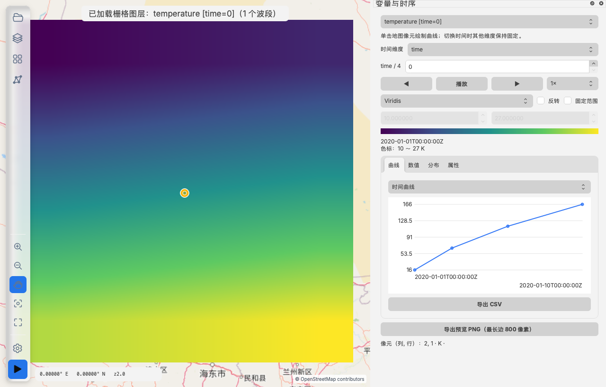

# GeoReader

GeoReader 是使用 Qt 6、Mapnik 和 GDAL/OGR 构建的桌面空间数据查看器，用于浏览矢量、栅格和多维科学数据。

## 功能

- 打开 Shapefile、GeoJSON、GeoPackage、GeoTIFF，以及 HDF4、HDF5、NetCDF / NetCDF4。
- 打开多维文件时选择变量及空间轴，按时间、深度等维度切片；无地理参考的数组可按像素查看。
- 点击像元绘制时序曲线，支持时间播放、行列剖面、邻域数值、变量属性和抽样直方图。
- 图层排序、显隐和透明度，矢量样式、RGB 波段组合、色带及显示范围调整。
- 地图平移缩放、要素识别、属性表查询，以及 CSV 和预览 PNG 导出。
- 发行包自带 GDAL 和科学数据运行库，使用者无需安装系统 GDAL。



## 编译

需要 C++20 编译器、CMake 3.25+、Qt 6.8+、GDAL 3.8+ 和 Mapnik 4。编译依赖由开发机提供，发行包需打包运行库。

### macOS

```bash
brew install cmake ninja qt gdal mapnik
# 为缺少 HDF4 的 Homebrew GDAL 构建配套驱动（当前配方匹配 GDAL 3.13.3）
bash scripts/build_hdf4_plugin.sh
cmake -S . -B build -G Ninja -DCMAKE_BUILD_TYPE=Release \
  -DGEOREADER_GDAL_PLUGIN_DIR="$PWD/.test-deps/hdf4-driver"
cmake --build build --parallel
open build/GeoReader.app
```

### Windows / Linux

安装 Qt 6.8+、GDAL 和 Mapnik 后，用 CMake 指向对应依赖安装目录：

```bash
cmake -S . -B build -G Ninja -DCMAKE_BUILD_TYPE=Release \
  -DCMAKE_PREFIX_PATH="<Qt及依赖安装目录>"
cmake --build build --parallel
```

Windows 使用 Visual Studio 2022 C++ 工具链；也可使用仓库的 `vcpkg.json` 和 `cmake/triplets` 管理依赖。
GDAL 必须启用 HDF4、HDF5 和 NetCDF 驱动；当前独立运行包已在 macOS arm64 验证，Windows/Linux 尚未完成同等验收。
完整依赖、打包和测试步骤见 [设计与工程说明](docs/DESIGN.md)。
